# Java_final_homework
Dai ma xie de shi yi yang, wo jue dui bu hui kan di er bian.
  
  
下面是使用说明：  
  
系统通过单击和双击左上角的“Submit an Expense Account”按钮，在系统欢迎页面、报销账单陈列页面以及报销账单编辑页面，三个页面之间进行切换。当处于系统欢迎页面时，单击“Submit an Expense Account”按钮可进入报销账单陈列页面。当处于其他两个页面时，单击“Submit an Expense Account”按钮可以在两个页面之间进行切换，双击按钮可以返回系统欢迎页面。  
系统中只存在一个JFrame，其他的窗口的弹出均为模态的JDialog。  
系统欢迎页面：  
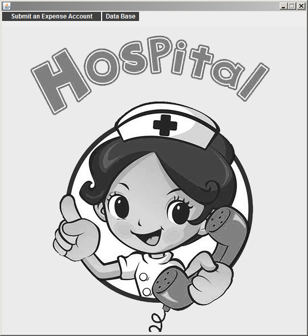  
  
报销账单陈列页面：  
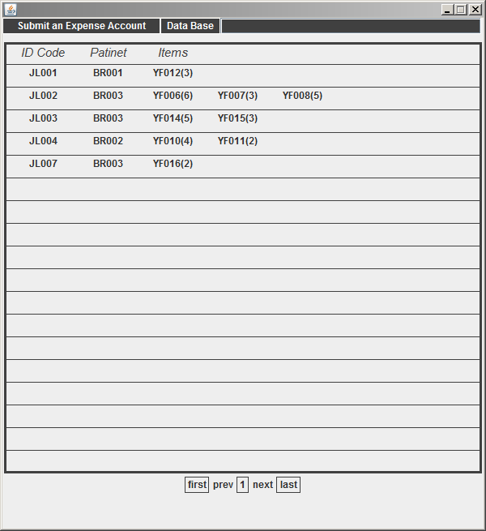  
  
表格最右侧一栏显示的是报销账单的编号，第二栏为其所属病人的编号，之后的项目为报销单所含的处方的基本信息，显示格式如图，为“处方编号(该处方中含有的项目个数)”。  
鼠标浮动在项目上，会有反色效果：  
  
  
右键点击账单项目会删除所点击的账单项目：  
  
  
左键点击账单项目会进入账单编辑页面，如果此时，在账单编辑页面有尚未保存的账单信息，会弹出如下提示框：  
  
  
点击“是”，则会完成在账单编辑窗口未完成的新增或者编辑账单的进程，点击“否”，则会放弃在账单编辑窗口的编辑工作。  
然后页面切换到账单编辑窗口，开始对左键点击的账单项目进行编辑。  
在“Data Base”按钮右侧，是一个背景色深灰色， 前景色白色的文本搜索框，可以对其中输入进的文字进行实时搜索，搜索的策略为，检查输入的文字是否为报销账单编号的子字符串。  
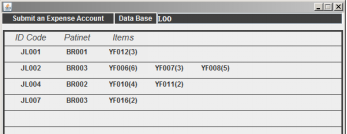  
（上图为检索“L00”的结果，所以编号为“JL013”的项目未被显示）  
单击页面空白处，可以开始一个新增账单的进程，如果账单编辑页面有未保存的信息，会显示与上面相同的提示框。  
  
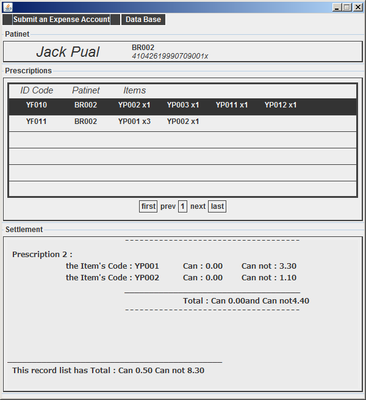  
上面板：账单对应病患的信息缩略会在此显示，点击上方的面板，会弹出信息选择窗口（病患单选页面）。  
中面板：账单对应的处方的信息缩略会在此显示，有鼠标浮上反色的效果，右键单击处方信息项目即可删除该处方，左键单击项目，会弹出信息选择窗口（服务项目多选页面）。  
下面板：账单结算清单会随账单的编辑，实时显示在下方的文本框内。而且，单击或者双击下方面板，可以完成对账单的保存、结算操作。  
账单的保存、结算，共四个状态：未保存、已保存、预结算、已结算。其中，在第一个状态下单击下方面板，可以进入第二个状态，面板中编辑的账单项目被存入系统。后两个状态下，账单无法再进行修改。在前两个状态下双击下方面板可以进入预结算状态，预结算状态下的账单项目在账单编辑栏中显示方式如下：  
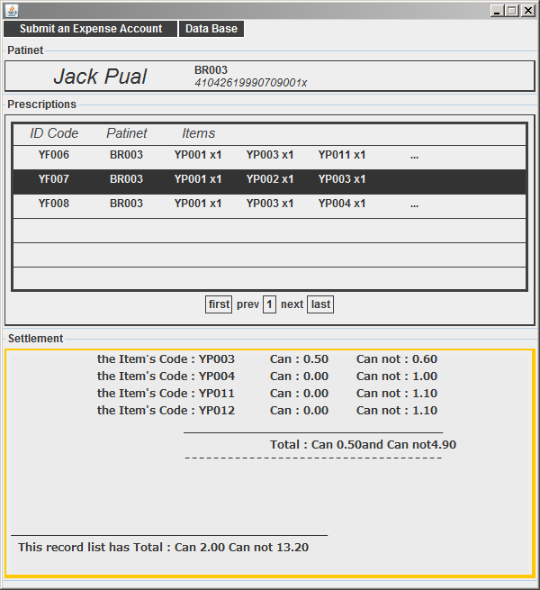  
下方面板的边框，会变成橘色。  
双击预结算状态下的账单对应的下面板，账单会进入已结算的状态。  
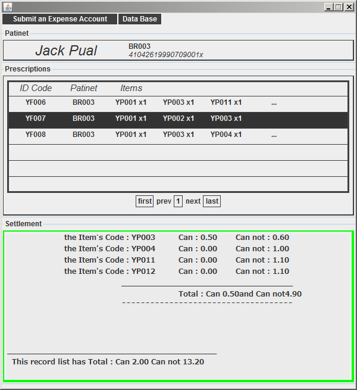  
下面板边框的显示为绿色。  
  
如上所说，左键单击上面板和中面板，会进入项目选择页面：  
项目选择页面（病患单选模式）：  
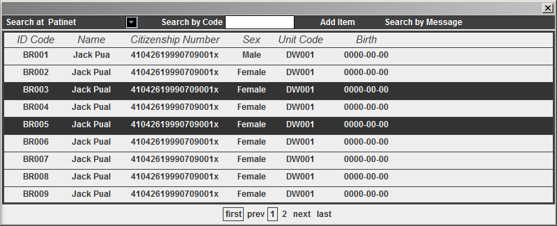  
具有鼠标浮动反色的效果，左键点击项目，出现与数据库界面相同的信息页面，而右键点击项目可以选中/取消选择点击的项目，被选中的项目，始终为深灰色底，白色字样，不会随鼠标浮动而改变颜色。  
在病患单选模式下，只允许选中一个病患，如果试图选择不是病人项目以外的其他项目，或者试图选中多个病人，会出现如下错误提示：  
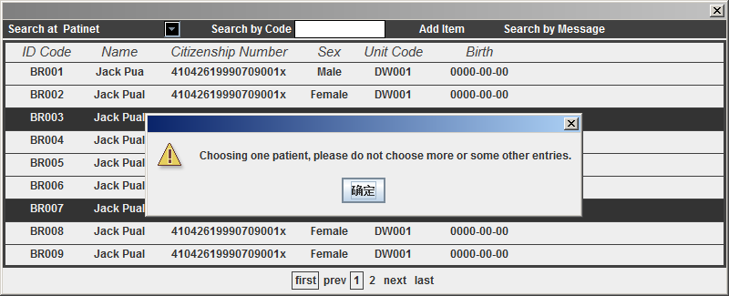  
  
项目选择页面（服务项目多选页面）  
左键点击项目，出现与数据库界面相同的信息页面，而右键点击项目可以选中/取消选择点击的项目，而与上一个模式不同的是，在这一个模式下只允许选择一到多项的服务项目，不允许选择病患和单位，且在选中的情况下，项目栏的右侧，会出现数目选择按钮，点击按钮，按钮上的数字会增加，代表该项服务的使用次数。  
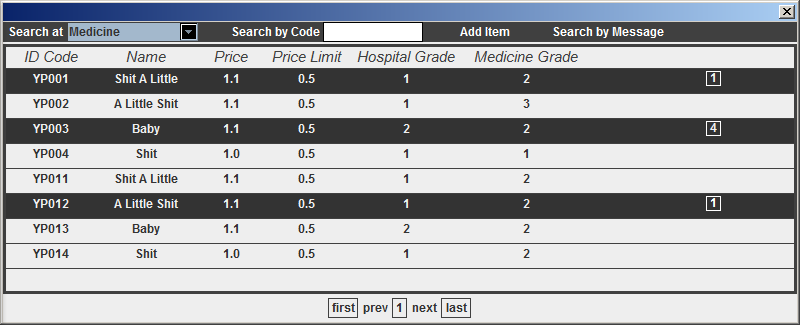  
  
项目选择页面在选择完成并退出后，账单编辑页面会显示出病人信息，或增加/更新了处方信息。  
  
  
系统通过单击左上角左数第二个的“Data Base”按钮，可以弹出数据库操作界面。  
  
  
左上角为下拉菜单，可以选择在不同的表中查找如“病人”，“药品”等。  
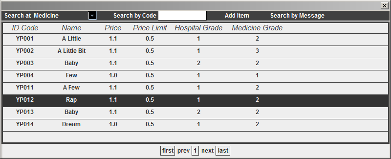  
  
上方还有搜索文本框，功能与账单陈列面板的搜索文本框相似，在此不作赘述。  
鼠标单击项目，会进入项目信息窗口（浏览/更新模式）。  
单击右上方的“Add Item”按钮，会进入项目信息窗口（增添模式）。  
单击右上方的“Search By Message”按钮，会进入项目信息窗口（搜索模式）。  
  
项目信息窗口（浏览/更新模式）  
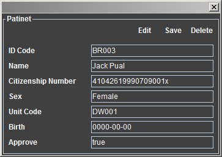  
显示了项目的完整信息，左上角的标题显示了项目所属的类别，在进入窗口时所有的文本框都是无法编辑的。点击“Edit”按钮，除了第一个文本框外的其他文本框变为可以进行编辑，即可开始对项目信息的编辑。“Save”与“Delete”按钮的功能与字面意思相同，点击后执行对应的操作并退出该窗口。  
项目信息窗口（增添模式）  
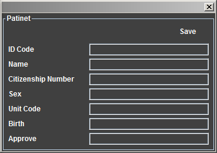  
所有的文本框均可以进行编辑，输入项目信息后，点击“Save”，即可存入系统中。  
其中一些项目被设为必填，如果不填写就点击“Save”，该文本框的边框会变为红色。  
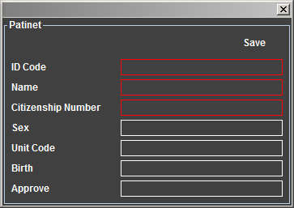  
文本框的输入有格式规定，如“病人”类型的“编号”，其格式用正则表达式表示为“^BR[0-9]{3}$”，如果某一项的输入格式不满足，点击“Save”，该项的文本框也会变成红色。  
  
如图，非必填项如果有输入，却不满足格式，也会被视为非法操作。  
项目信息窗口（搜索模式）  
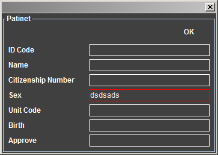  
搜索窗口实现了循信息搜索项目的功能，输入一部分信息，即可搜索出与信息相配的项目，文本框无必填项，但有输入的项目，必须满足输入格式。  
以下为搜索过程的例子  
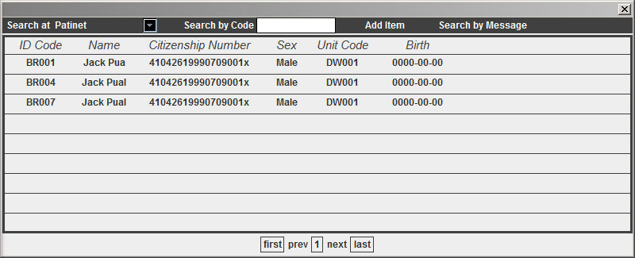  
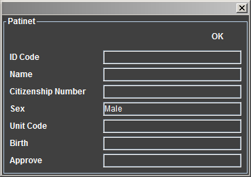  
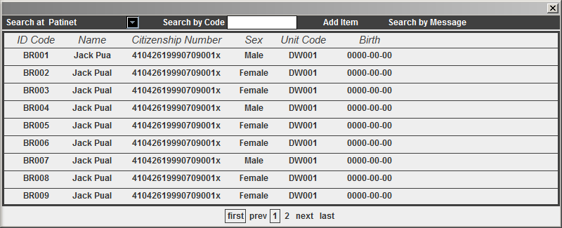  
  
  
系统页码显示规则：  
系统中所有含有分页和页码的界面，页码显示规则如下：  
显示“first”“last”“next”“prev”四个功能按键，其功能顾名思义，当处于第一页的时候，“first”按键会显示深灰色边框以提示页数，当处于最后一页的时候，“last”按键亦然。  
如果总页数不超过6页，则显示所有的页数的数字页码。  
如果总页数超过6页，则只显示当前页码附近的6个（含当前）数字页码。记当前页码左侧显示了i个页码，右侧显示了5 - i个页码，则该策略要求尽量让i的值接近2。  
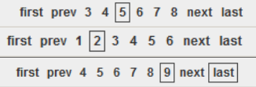  

